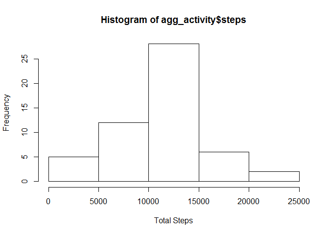
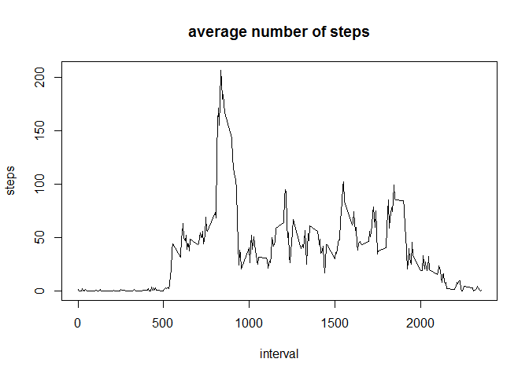
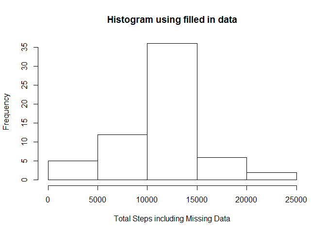
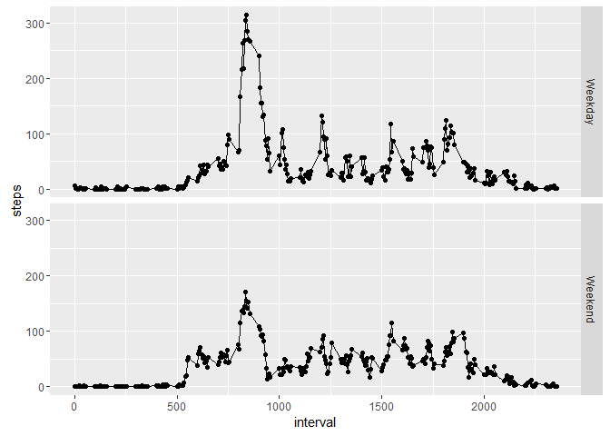

#  Reproducible Research Project 1
Rakesh Prusty  
June 30, 2016  

##1. Loading and preprocessing the data

```r
activity <- read.csv("activity.csv")
```

##2. What is mean total number of steps taken per day?

```r
agg_activity <- aggregate(steps~date,activity,sum)
hist(agg_activity$steps,xlab = "Total Steps")
```

<!-- -->

```r
meanstep <- mean(agg_activity$steps)
medstep <- median(agg_activity$steps)
```

The Mean of total number of steps taken is 1.0766189\times 10^{4}.  
The Median of total number of steps taken is 10765.  


##3. What is the average daily activity pattern?

```r
aggint <- aggregate(steps~interval,activity,mean)
with(aggint,plot(interval,steps,type = "l",main = "average number of steps"))
```

<!-- -->

```r
maxsteps <- max(aggint$steps)
maxint <- subset(aggint,steps >= maxsteps)
maxans <- maxint[1,1]
```
The 5-minute interval that, on average, contains the maximum number of steps is 835.

##4. Imputing missing values

```r
library("dplyr")
```

```
## Warning: package 'dplyr' was built under R version 3.2.5
```

```
## 
## Attaching package: 'dplyr'
```

```
## The following objects are masked from 'package:stats':
## 
##     filter, lag
```

```
## The following objects are masked from 'package:base':
## 
##     intersect, setdiff, setequal, union
```

```r
sum_missing <- sum(is.na(activity$steps))
impute_act <- mutate(activity,steps=ifelse(is.na(activity$steps),aggint$steps[match(activity$interval,aggint$interval)],activity$steps))
```
Number of missing value is 2304. The missing values are relpaced with average value and new data set, impute_act has been prepared. 


```r
agg_impute_act <- aggregate(steps~date,impute_act,sum)
hist(agg_impute_act$steps,xlab = "Total Steps including Missing Data",main = "Histogram using filled in data")
```

<!-- -->

```r
impute_mean <- mean(agg_impute_act$steps)
impute_med <- 	median(agg_impute_act$steps)
```
The mean of imputed data is 1.0766189\times 10^{4} and median of imputed data is 1.0766189\times 10^{4}.  

##5. Are there differences in activity patterns between weekdays and weekends?

```r
weekdays <- c("Monday", "Tuesday", "Wednesday", "Thursday", "Friday")
impute_act$dow = as.factor(ifelse(is.element(weekdays(as.Date(impute_act$date)),weekdays), "Weekday", "Weekend"))
library(ggplot2)
```

```
## Warning: package 'ggplot2' was built under R version 3.2.5
```

```r
final_agg <- aggregate(steps ~ interval + dow,impute_act,mean)
qplot(interval,steps,data = final_agg,geom = c("point","line"),facets = dow~.)
```

<!-- -->
